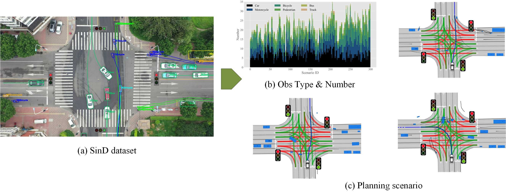
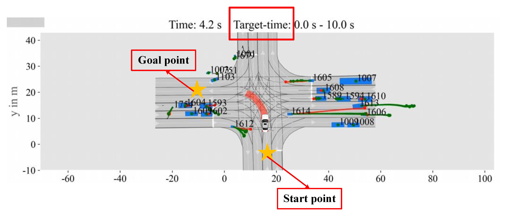

# Strategy-Interactive Trajectory Prediction: Towards Effective Interaction Modeling and Planning Integration
[arXiv]() | [paper]() | [website]()\
This repository is the official implementation of SITP.
SITP is a novel predictor capable of outputting trajectory prediction results and strategies

<div style="text-align:center;">

</div>

Furthermore, sitp can assist downstream planning for autonomous vehicles.

<div style="text-align:center;">

</div>

## Table of Contents
+ [Setup](#setup)
+ [Datasets](#datasets)
+ [Training](#training)
+ [Validation](#validation)
+ [Pre-trained Models](#pre-trained-models)
+ [Planning Scenarios](#planning-scenarios)
+ [Acknowledgements](#acknowledgements)

## Setup
Clone the repository and set up the environment:
```
git clone https://github.com/salt0107fish/sitp.git
cd sitp
conda create -n sitp python=3.7
conda activate sitp
pip install -r requirement.txt
```
*Note:* For compatibility, you may experiment with different pytorch versions. We use PyTorch 1.12.1 with cu113.

## Datasets

<details>
<summary><b>INTERACTION</b></summary>
<p>

1. Download the [INTERACTION Dataset v1.2](https://interaction-dataset.com/). Here, we only need the data for the multi-agent tracks. After downloading and extracting the zip files, organize the dataset directory as follows:

```
/path/to/INTERACTION_root/
├── maps/
├── test_conditional-multi-agent/
├── test_multi-agent/
├── train/
│   ├── DR_CHN_Merging_ZS0_train
│   ├── ...
└── val/
    ├── DR_CHN_Merging_ZS0_val
    ├── ...

```

</p>
</details>


## Validation

Data preprocessing may take several hours the first time you run this project. We use single RTX 3060 GPU, one epoch takes about 12 minutes in INTERACTION.

```

# For INTERACTION
python evaluate.py --dataset-path /path/to/your/dataset/ --models-path /path/to/your/model.pth
```

## Pre-trained Models

- **Pre-trained model:** You can download the pretrained model for INTERACTION. [Download here](https://drive.google.com/file/d/1sQdil7ghuFaLIGEuhIJeN4e5KdTvPIlE/view?usp=drive_link)

- **Validation results:**

Results in validation set:

| Method | minADE6| minFDE6 |
|----------|----------|----------|
| SITP | 0.1394 | 0.4071|

### SIND

## Planning Scenarios

300 scenarios we made are used. The starting and goal points of the planning tasks are manually imported and configured, and the scenarios comply with the official [CommonRoad](https://commonroad.in.tum.de/) format. Each scenario includes a complete driving task, incorporating map information, traffic participants, and traffic signal data imported from the real-world driving dataset [SinD](https://github.com/SOTIF-AVLab/SinD). A small planning benchmark for these scenarios is also released in the paper.

<div style="text-align:center;">

</div>

- **Hand-crafted scenarios:** [Download here](https://drive.google.com/drive/folders/1g--HQxRF8VNl3f6WRguAq5uaUZV1eCfu?usp=drive_link)

- **Scenario illustration:**


<div style="text-align:center;">

</div>


## TODO LIST

- [x] Introduction & DEMO
- [x] Hand-crafted scenario
- [x] Pretrained model
- [x] Validation scripts
- [ ] Data pre-process
- [ ] Training scripts


## Acknowledgements

## Citation
