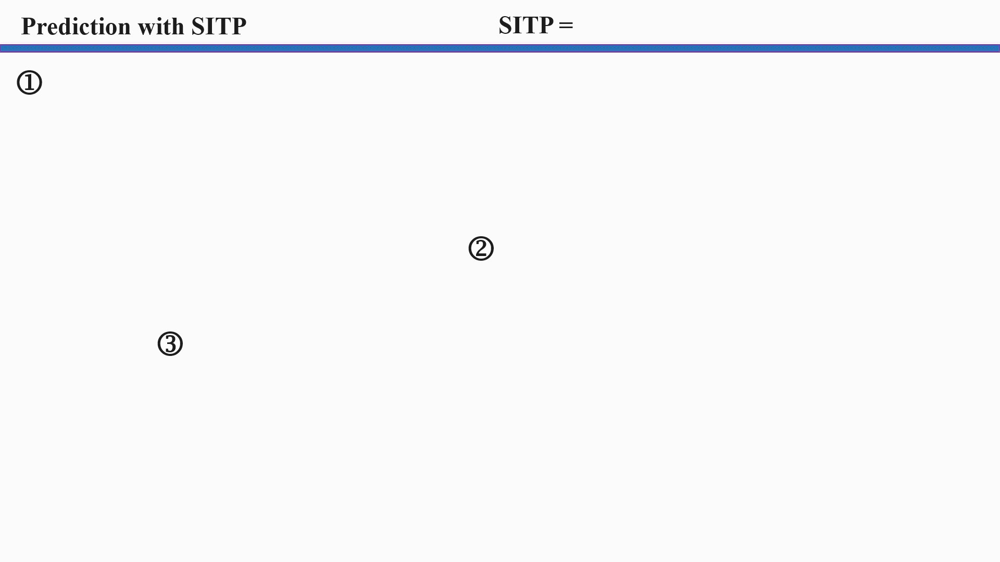

# Strategy-Interactive Trajectory Prediction: Towards Effective Interaction Modeling and Planning Integration
[arXiv]() | [paper]() | [poster]()\
This repository is the official implementation of SITP.
SITP is a novel predictor capable of outputting trajectory prediction results and strategies

Furthermore, sitp can assist downstream planning for autonomous vehicles.


## Table of Contents
+ [Setup](#setup)
+ [Datasets](#datasets)
+ [Training](#training)
+ [Validation](#validation)
+ [Pre-trained Models](#pre-trained-models)
+ [Planning Scenarios](#planning-scenarios)
+ [Acknowledgements](#acknowledgements)

## Setup
Clone the repository and set up the environment:
```
git clone https://github.com/salt0107fish/sitp.git
cd sitp
conda create -n sitp python=3.7
conda activate sitp
pip install -t requirement.txt
```
*Note:* For compatibility, you may experiment with different pytorch versions. We use PyTorch 1.12.1 with cu113.

## Datasets

<details>
<summary><b>INTERACTION</b></summary>
<p>

1. Download the [INTERACTION Dataset v1.2](https://interaction-dataset.com/). Here, we only need the data for the multi-agent tracks. After downloading and extracting the zip files, organize the dataset directory as follows:

```
/path/to/INTERACTION_root/
├── maps/
├── test_conditional-multi-agent/
├── test_multi-agent/
├── train/
│   ├── DR_CHN_Merging_ZS0_train
│   ├── ...
└── val/
    ├── DR_CHN_Merging_ZS0_val
    ├── ...

```

</p>
</details>


## Validation

Data preprocessing may take several hours the first time you run this project. We use single RTX 3060 GPU, one epoch takes about 12 minutes INTERACTION.

```

# For INTERACTION
python HPNet-INTERACTION/val.py --dataset-path /path/to/your/dir/ --models-path /path/to/your/model.pth
```

## Pre-trained Models


### INTERACTION
- **Pre-trained model:** [Download here](https://drive.google.com/drive/folders/1g--HQxRF8VNl3f6WRguAq5uaUZV1eCfu?usp=drive_link)

## Planning Scenarios

300 scenarios are used. The starting and ending points of the planning tasks are manually imported and configured, and the scenarios comply with the official [CommonRoad](https://commonroad.in.tum.de/) format.

- **Hand-crafted scenarios:** [Download here](https://drive.google.com/drive/folders/1g--HQxRF8VNl3f6WRguAq5uaUZV1eCfu?usp=drive_link)


## TODO LIST

- [x] Introduction & DEMO
- [x] Hand-crafted scenario
- [] Pretrained model
- [] Validation scripts
- [] Data pre-process
- [] Training scripts


## Acknowledgements
We sincerely appreciate [Sind](https://github.com/SOTIF-AVLab/SinD), [INTERACTION](https://github.com/interaction-dataset/interaction-dataset),[Autobot](https://github.com/roggirg/AutoBots) and [DEMO](https://github.com/fudan-zvg/DeMo) for their awesome codebases.


## Citation
